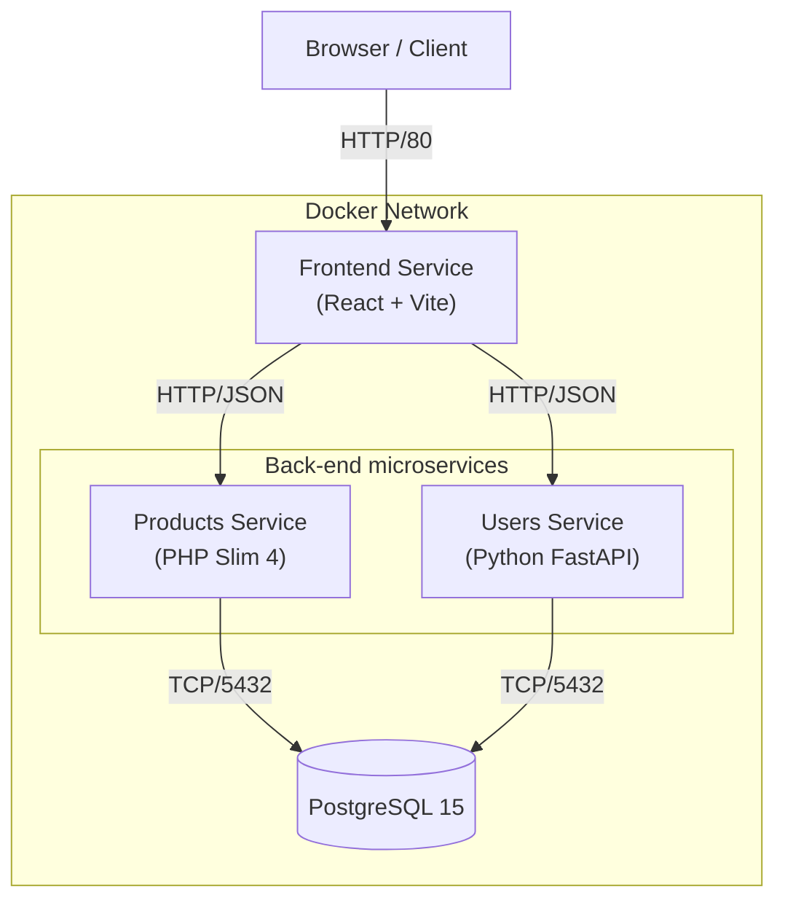

# E-commerce Starter Project Architecture

The E-commerce Starter Project is a microservices-based web application designed for university students to learn end-to-end application development.

## System Overview
The system consists of a Single Page Application (SPA) frontend and two distinct backend services, all orchestrated via Docker Compose.

### Architecture Diagram

### Components

1.  **Frontend**
    -   **Tech Stack**: React 19.2.0, Vite 7.2.4, Tailwind CSS 4.1.17 (Node.js 20-alpine environment).
    -   **Role**: User interface for browsing products and managing user accounts.
    -   **Communication**: Consumes HTTP/1.1 JSON REST APIs exposed by the backend services.

2.  **Products Service**
    -   **Tech Stack**: PHP 8.2 (Apache), Slim 4.15.1.
    -   **Role**: Manages product catalog (CRUD operations).
    -   **Port**: Exposed on host port `8082` (internal `80`).

3.  **Users Service**
    -   **Tech Stack**: Python 3.10 (Slim), FastAPI 0.120.0.
    -   **Role**: Handles user registration and authentication.
    -   **Port**: Exposed on host port `8000` (internal `8000`).

4.  **Database**
    -   **Tech Stack**: PostgreSQL 18.1-alpine.
    -   **Role**: Shared persistent storage for both services (Database: `ecommerce_db`).

## Infrastructure
-   **Containerization**: All components are containerized using Docker.
-   **Orchestration**: `docker-compose.yml` manages the service lifecycle and creates a default bridge network.
-   **Configuration**: Environment variables (ports, credentials) are centralized in a `.env` file.
