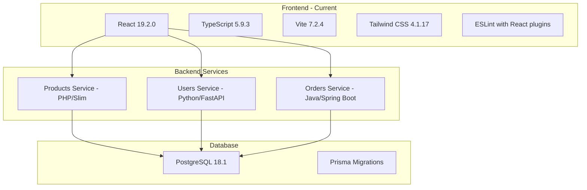
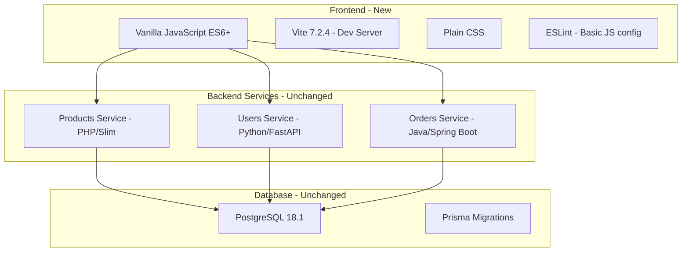

# Frontend Conversion Plan: React+TypeScript to Vanilla JavaScript

## Overview

This plan outlines the conversion of the e-commerce starter frontend from React + TypeScript + Vite + Tailwind CSS to **Vanilla JavaScript + Vite + Plain CSS**.

## Current Architecture



## Target Architecture



## Files to Remove

| File | Reason |
|------|--------|
| [`frontend/tsconfig.json`](frontend/tsconfig.json) | TypeScript configuration |
| [`frontend/tsconfig.app.json`](frontend/tsconfig.app.json) | TypeScript app configuration |
| [`frontend/tsconfig.node.json`](frontend/tsconfig.node.json) | TypeScript node configuration |
| [`frontend/src/main.tsx`](frontend/src/main.tsx) | React entry point |
| [`frontend/src/App.tsx`](frontend/src/App.tsx) | React component |
| [`frontend/src/index.css`](frontend/src/index.css) | Tailwind CSS import |
| [`frontend/eslint.config.js`](frontend/eslint.config.js) | React-specific ESLint config (if exists) |

## Files to Create

### 1. New Project Structure

```
frontend/
├── index.html              # Updated HTML entry point
├── package.json            # Simplified dependencies
├── vite.config.js          # Vanilla JS Vite config
├── Dockerfile              # Updated if needed
├── public/
│   └── vite.svg           # Keep existing
└── src/
    ├── main.js            # JavaScript entry point
    ├── styles.css         # Plain CSS styles
    ├── api/
    │   └── api.js         # API communication module
    └── components/
        ├── products.js    # Products display module
        ├── users.js       # Users display module
        └── orders.js      # Orders display module
```

### 2. Package.json Changes

**Remove dependencies:**
- `react`
- `react-dom`
- `@tailwindcss/postcss`
- `@types/react`
- `@types/react-dom`
- `@vitejs/plugin-react`
- `typescript`
- `typescript-eslint`
- `eslint-plugin-react-hooks`
- `eslint-plugin-react-refresh`
- `autoprefixer`
- `postcss`
- `tailwindcss`

**Keep dependencies:**
- `vite` - Development server and build tool
- `eslint` - Basic JavaScript linting
- `@eslint/js` - ESLint JavaScript config
- `globals` - Global variables for ESLint

### 3. New File Contents

#### [`frontend/vite.config.js`](frontend/vite.config.js)
```javascript
import { defineConfig } from 'vite'

export default defineConfig({
  server: {
    host: true,
    port: 5173
  }
})
```

#### [`frontend/index.html`](frontend/index.html)
```html
<!DOCTYPE html>
<html lang="en">
  <head>
    <meta charset="UTF-8" />
    <link rel="icon" type="image/svg+xml" href="/vite.svg" />
    <meta name="viewport" content="width=device-width, initial-scale=1.0" />
    <title>E-commerce Starter</title>
    <link rel="stylesheet" href="/src/styles.css" />
  </head>
  <body>
    <div id="app"></div>
    <script type="module" src="/src/main.js"></script>
  </body>
</html>
```

#### [`frontend/src/main.js`](frontend/src/main.js)
```javascript
import { renderProducts } from './components/products.js'
import { renderUsers } from './components/users.js'
import { renderOrders } from './components/orders.js'

// API URLs from environment variables
const config = {
  productsApiUrl: import.meta.env.VITE_PRODUCTS_API_URL,
  usersApiUrl: import.meta.env.VITE_USERS_API_URL,
  ordersApiUrl: import.meta.env.VITE_ORDERS_API_URL
}

async function init() {
  const app = document.getElementById('app')
  
  app.innerHTML = `
    <header class="header">
      <h1>E-commerce Starter</h1>
      <p>Frontend is running successfully!</p>
    </header>
    
    <main class="main">
      <section class="api-info">
        <h2>API Configuration</h2>
        <ul>
          <li>Products API: ${config.productsApiUrl}</li>
          <li>Users API: ${config.usersApiUrl}</li>
          <li>Orders API: ${config.ordersApiUrl}</li>
        </ul>
      </section>
      
      <section id="products-section" class="data-section">
        <h2>Products</h2>
        <div id="products-container" class="loading">Loading...</div>
      </section>
      
      <section id="users-section" class="data-section">
        <h2>Users</h2>
        <div id="users-container" class="loading">Loading...</div>
      </section>
      
      <section id="orders-section" class="data-section">
        <h2>Orders</h2>
        <div id="orders-container" class="loading">Loading...</div>
      </section>
    </main>
  `
  
  // Fetch and render data
  await Promise.all([
    renderProducts(config.productsApiUrl),
    renderUsers(config.usersApiUrl),
    renderOrders(config.ordersApiUrl)
  ])
}

init()
```

#### [`frontend/src/api/api.js`](frontend/src/api/api.js)
```javascript
export async function fetchData(url) {
  try {
    const response = await fetch(url)
    if (!response.ok) {
      throw new Error(`HTTP error! status: ${response.status}`)
    }
    return await response.json()
  } catch (error) {
    console.error('Fetch error:', error)
    throw error
  }
}
```

#### [`frontend/src/components/products.js`](frontend/src/components/products.js)
```javascript
import { fetchData } from '../api/api.js'

export async function renderProducts(apiUrl) {
  const container = document.getElementById('products-container')
  
  try {
    const products = await fetchData(`${apiUrl}/products`)
    
    if (products.length === 0) {
      container.innerHTML = '<p class="empty">No products found</p>'
      return
    }
    
    container.innerHTML = `
      <div class="card-grid">
        ${products.map(product => `
          <div class="card">
            <h3>${product.name}</h3>
            <p class="description">${product.description || 'No description'}</p>
            <p class="price">$${product.price}</p>
            <p class="stock">Stock: ${product.stock}</p>
          </div>
        `).join('')}
      </div>
    `
    container.classList.remove('loading')
  } catch (error) {
    container.innerHTML = `<p class="error">Error loading products: ${error.message}</p>`
    container.classList.remove('loading')
  }
}
```

#### [`frontend/src/components/users.js`](frontend/src/components/users.js)
```javascript
import { fetchData } from '../api/api.js'

export async function renderUsers(apiUrl) {
  const container = document.getElementById('users-container')
  
  try {
    const users = await fetchData(`${apiUrl}/users`)
    
    if (users.length === 0) {
      container.innerHTML = '<p class="empty">No users found</p>'
      return
    }
    
    container.innerHTML = `
      <div class="card-grid">
        ${users.map(user => `
          <div class="card">
            <h3>${user.name || 'Unnamed User'}</h3>
            <p class="email">${user.email}</p>
            <p class="role">Role: ${user.role}</p>
          </div>
        `).join('')}
      </div>
    `
    container.classList.remove('loading')
  } catch (error) {
    container.innerHTML = `<p class="error">Error loading users: ${error.message}</p>`
    container.classList.remove('loading')
  }
}
```

#### [`frontend/src/components/orders.js`](frontend/src/components/orders.js)
```javascript
import { fetchData } from '../api/api.js'

export async function renderOrders(apiUrl) {
  const container = document.getElementById('orders-container')
  
  try {
    const orders = await fetchData(`${apiUrl}/orders`)
    
    if (orders.length === 0) {
      container.innerHTML = '<p class="empty">No orders found</p>'
      return
    }
    
    container.innerHTML = `
      <div class="card-grid">
        ${orders.map(order => `
          <div class="card">
            <h3>Order #${order.id}</h3>
            <p>User ID: ${order.userId}</p>
            <p class="price">Total: $${order.totalAmount}</p>
            <p class="status">Status: ${order.status?.name || 'Unknown'}</p>
            <p class="date">Created: ${new Date(order.createdAt).toLocaleDateString()}</p>
          </div>
        `).join('')}
      </div>
    `
    container.classList.remove('loading')
  } catch (error) {
    container.innerHTML = `<p class="error">Error loading orders: ${error.message}</p>`
    container.classList.remove('loading')
  }
}
```

#### [`frontend/src/styles.css`](frontend/src/styles.css)
```css
/* Reset and base styles */
* {
  margin: 0;
  padding: 0;
  box-sizing: border-box;
}

body {
  font-family: -apple-system, BlinkMacSystemFont, 'Segoe UI', Roboto, Oxygen, Ubuntu, sans-serif;
  background-color: #f5f5f5;
  color: #333;
  line-height: 1.6;
}

/* Header */
.header {
  background-color: #2563eb;
  color: white;
  padding: 2rem;
  text-align: center;
}

.header h1 {
  font-size: 2rem;
  margin-bottom: 0.5rem;
}

/* Main content */
.main {
  max-width: 1200px;
  margin: 0 auto;
  padding: 2rem;
}

/* API Info section */
.api-info {
  background-color: white;
  padding: 1.5rem;
  border-radius: 8px;
  box-shadow: 0 2px 4px rgba(0, 0, 0, 0.1);
  margin-bottom: 2rem;
}

.api-info h2 {
  margin-bottom: 1rem;
  color: #1e40af;
}

.api-info ul {
  list-style: none;
}

.api-info li {
  padding: 0.5rem 0;
  border-bottom: 1px solid #e5e7eb;
  font-family: monospace;
  font-size: 0.9rem;
}

/* Data sections */
.data-section {
  background-color: white;
  padding: 1.5rem;
  border-radius: 8px;
  box-shadow: 0 2px 4px rgba(0, 0, 0, 0.1);
  margin-bottom: 2rem;
}

.data-section h2 {
  margin-bottom: 1rem;
  color: #1e40af;
  border-bottom: 2px solid #2563eb;
  padding-bottom: 0.5rem;
}

/* Card grid */
.card-grid {
  display: grid;
  grid-template-columns: repeat(auto-fill, minmax(280px, 1fr));
  gap: 1rem;
}

.card {
  background-color: #f9fafb;
  border: 1px solid #e5e7eb;
  border-radius: 8px;
  padding: 1rem;
  transition: box-shadow 0.2s;
}

.card:hover {
  box-shadow: 0 4px 6px rgba(0, 0, 0, 0.1);
}

.card h3 {
  color: #1f2937;
  margin-bottom: 0.5rem;
}

.card .description {
  color: #6b7280;
  font-size: 0.9rem;
  margin-bottom: 0.5rem;
}

.card .price {
  color: #059669;
  font-weight: bold;
  font-size: 1.1rem;
}

.card .stock,
.card .role,
.card .status,
.card .date,
.card .email {
  color: #6b7280;
  font-size: 0.85rem;
}

/* Loading state */
.loading {
  text-align: center;
  padding: 2rem;
  color: #6b7280;
}

/* Error state */
.error {
  color: #dc2626;
  background-color: #fef2f2;
  padding: 1rem;
  border-radius: 4px;
  border: 1px solid #fecaca;
}

/* Empty state */
.empty {
  color: #6b7280;
  text-align: center;
  padding: 2rem;
  font-style: italic;
}

/* Responsive */
@media (max-width: 768px) {
  .main {
    padding: 1rem;
  }
  
  .header {
    padding: 1.5rem 1rem;
  }
  
  .header h1 {
    font-size: 1.5rem;
  }
}
```

#### [`frontend/package.json`](frontend/package.json) - New Version
```json
{
  "name": "frontend",
  "private": true,
  "version": "0.0.0",
  "type": "module",
  "scripts": {
    "dev": "vite",
    "build": "vite build",
    "preview": "vite preview",
    "lint": "eslint src"
  },
  "devDependencies": {
    "@eslint/js": "^9.39.1",
    "eslint": "^9.39.1",
    "globals": "^16.5.0",
    "vite": "^7.2.4"
  }
}
```

## Implementation Steps

### Phase 1: Clean Up
1. Delete TypeScript configuration files
2. Delete React source files (main.tsx, App.tsx)
3. Delete Tailwind CSS file

### Phase 2: Update Configuration
4. Update package.json with simplified dependencies
5. Create new vite.config.js (vanilla JS version)
6. Update index.html for vanilla JS

### Phase 3: Create New Source Files
7. Create src/main.js entry point
8. Create src/styles.css with plain CSS
9. Create src/api/api.js for API communication
10. Create src/components/products.js
11. Create src/components/users.js
12. Create src/components/orders.js

### Phase 4: Docker Updates
12. Verify Dockerfile works with new setup (should work as-is)
13. Verify docker-compose.yml environment variables

### Phase 5: Testing
14. Run `npm install` to update dependencies
15. Run `npm run dev` to test development server
16. Test API connections with backend services
17. Run `npm run build` to verify production build

## Environment Variables

The frontend will continue to use the same environment variables:
- `VITE_PRODUCTS_API_URL` - Products service URL
- `VITE_USERS_API_URL` - Users service URL  
- `VITE_ORDERS_API_URL` - Orders service URL

These are accessed via `import.meta.env.VITE_*` in vanilla JavaScript (same as React).

## Benefits of This Approach

1. **Simpler for beginners** - No JSX, no TypeScript, no build-time CSS processing
2. **Faster development** - Less tooling overhead
3. **Easier debugging** - Code runs as-is in the browser
4. **Modern JavaScript** - Uses ES6 modules, async/await, template literals
5. **Vite benefits retained** - Hot module replacement, fast builds, environment variables

## Risks and Mitigations

| Risk | Mitigation |
|------|------------|
| CORS issues with API calls | Backend services already configured for CORS |
| Environment variables not loading | Vite handles VITE_* prefix automatically |
| Module loading issues | Using type="module" in script tag |

## Notes for Students

This vanilla JavaScript setup demonstrates:
- ES6 module imports/exports
- Async/await for API calls
- Template literals for HTML generation
- CSS Grid and Flexbox for layouts
- Error handling patterns
- Environment variable usage
